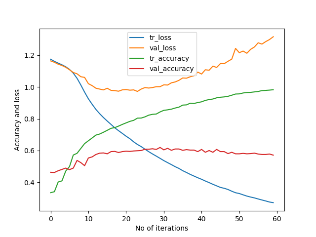

# DrivingDirection-8-62
163/163 [==============================] - 0s 2ms/step - loss: 0.2722 - accuracy: 0.9829 - val_loss: 1.3166 - val_accuracy: 0.5712  
[[235  55  47]    
 [ 78  76  20]    
 [ 95  15 102]]    
163/163 [==============================] - 0s 873us/step - loss: 0.5380 - accuracy: 0.8532   
23/23 [==============================] - 0s 709us/step - loss: 1.0022 - accuracy: 0.6196     
Train: 0.853, Test: 0.620   
[[239  54  44]               
 [ 73  81  20]              
 [ 66  18 128]]              

 
 
